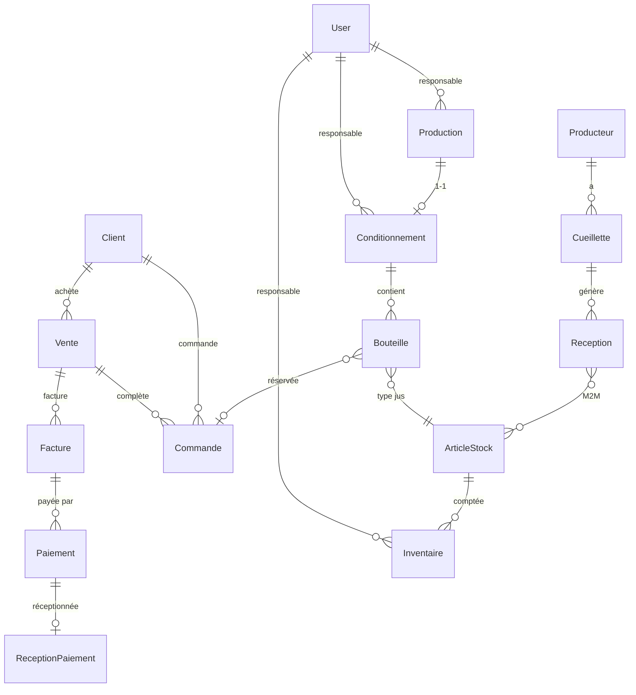

# orange_v1.md — Guide maître JusOrange GDA (OrangeGda)

> **Document de référence** pour reproduire rapidement une application Django métier complète.  
> Ce guide consolide tout ce qui a été fait sur **OrangeGda** — base de données, modèles, migrations, backend, templates, auth, reporting — ainsi que **l'ensemble des prompts** utilisés avec l'agent IA Cursor.  
> Pour la partie **DB / modèles / migrations**, OrangeGda est la référence la plus aboutie.

---

## Table des matières

1. [Vue d'ensemble du projet](#1-vue-densemble-du-projet)
2. [Stack technique](#2-stack-technique)
3. [Architecture globale](#3-architecture-globale)
4. [Structure des dossiers](#4-structure-des-dossiers)
5. [Base de données MySQL](#5-base-de-données-mysql)
6. [Modèles et relations (schéma complet)](#6-modèles-et-relations-schéma-complet)
7. [Migrations — stratégie OrangeGda](#7-migrations--stratégie-orangegda)
8. [Backend Django](#8-backend-django)
9. [Frontend — Templates Django (pas Blade)](#9-frontend--templates-django-pas-blade)
10. [Authentification et rôles](#10-authentification-et-rôles)
11. [Reporting et exports Excel](#11-reporting-et-exports-excel)
12. [Commandes de gestion (management commands)](#12-commandes-de-gestion-management-commands)
13. [Chronologie du développement (phases)](#13-chronologie-du-développement-phases)
14. [Historique complet des prompts IA](#14-historique-complet-des-prompts-ia)
15. [Checklist — reproduire une nouvelle app rapidement](#15-checklist--reproduire-une-nouvelle-app-rapidement)
16. [Commandes utiles](#16-commandes-utiles)
17. [Dépannage](#17-dépannage)
18. [Documentation complémentaire](#18-documentation-complémentaire)

---

## 1. Vue d'ensemble du projet

**JusOrange GDA** est une application web de gestion de la production et commercialisation de jus d'orange.

| Domaine | Contenu |
|---------|---------|
| **Production** | Producteurs, cueillettes, réceptions, fabrication, conditionnement, inventaires |
| **Commercial** | Clients, commandes, ventes, factures, paiements |
| **Finance** | Trésorerie, réception des paiements, gestion des écarts |
| **Direction** | Dashboard global, rapports, création d'utilisateurs |
| **Reporting** | Rapports par période + export Excel stylé orange |

### Apps Django et modules métier

| Module métier | App Django | Rôle |
|---------------|------------|------|
| Récolte (Producteurs & Cueillettes) | `recolte` | Données agricoles |
| Réception & Stock | `appro` | Articles stock + réceptions oranges |
| Production | `fabrication` | Ordres de fabrication (OF) |
| Conditionnement | `emballage` | Conditionnements + bouteilles |
| Inventaire | `entrepot` | Comptages physiques |
| Commercialisation | `distribution` | Clients, ventes, factures, paiements |
| Reporting + Vues par rôle | `reporting` | Dashboards, rapports, vues consolidées |
| Sécurité & Utilisateurs | `accounts` | Auth, groupes, middleware |

> **Note importante :** Le projet Django s'appelle `JusOrange` (dossier `JusOrange/`), le repo s'appelle `OrangeGda`. Ce n'est **pas** Laravel — les vues HTML sont des **templates Django** (syntaxe ``), pas des fichiers Blade.

---

## 2. Stack technique

```
Python 3.12+ (testé aussi sur 3.14 avec correctif)
Django 4.2.x
MySQL / MariaDB (via XAMPP)
PyMySQL (driver MySQL)
openpyxl (exports Excel)
Bootstrap Icons (UI)
```

**Fichier `requirements.txt` :**
```
Django>=4.2,<5.0
openpyxl>=3.1.0
PyMySQL>=1.1.0
```

---

## 3. Architecture globale

```
Utilisateur
    │
    ▼
LoginRequiredMiddleware (auth + contrôle rôle)
    │
    ▼
JusOrange/urls.py
    ├── accounts.urls  → login, logout, password-reset, créer utilisateur
    └── reporting.urls → TOUTES les vues métier + rapports
            ├── views_resprod.py    → ResProd (récolte, appro, fab, emballage, entrepôt)
            ├── views_commercial.py → Commercial (distribution)
            ├── views_finance.py    → Finance (trésorerie)
            └── views.py            → Dashboards + rapports
    │
    ▼
Apps métier (models, forms, admin, signals)
    recolte / appro / fabrication / emballage / distribution / entrepot
    │
    ▼
MySQL (base jusorange)
```

### Décision clé — Refactoring par rôle utilisateur

Les vues et templates ont été **réorganisés par type d'utilisateur** (et non plus par module technique) :

| Rôle | Vues Python | Templates |
|------|-------------|-----------|
| **ResProd** | `reporting/views_resprod.py` | `templates/resprod/` |
| **Commercial** | `reporting/views_commercial.py` | `templates/commercial/` |
| **Finance** | `reporting/views_finance.py` | `templates/finance/` |
| **Direction** | `reporting/views.py` | `templates/direction/` |
| **Reporting** | `reporting/views.py` | `templates/reporting/` |
| **Auth** | `accounts/views.py` | `templates/auth/` |

Les apps `recolte`, `appro`, etc. conservent **models, forms, admin, signals** — leurs `views.py` et `urls.py` ne sont plus routés.

---

## 4. Structure des dossiers

```
OrangeGda/
├── manage.py                          ← Commandes Django (toujours depuis ici)
├── requirements.txt
├── JusOrange/                         ← Projet Django (settings, urls, middleware)
│   ├── __init__.py                    ← PyMySQL + correctif Python 3.14
│   ├── settings.py
│   ├── urls.py
│   ├── middleware.py                  ← Auth obligatoire + contrôle rôles
│   ├── wsgi.py
│   └── asgi.py
├── accounts/                          ← Auth (pas de models.py propre)
│   ├── views.py
│   ├── forms.py
│   ├── decorators.py
│   ├── context_processors.py
│   ├── urls.py
│   └── management/commands/
│       ├── create_groups.py
│       ├── create_users.py
│       └── reset_db_create_users.py
├── recolte/                           ← Producteur, Cueillette
├── appro/                             ← ArticleStock, Reception
├── fabrication/                       ← Production
├── emballage/                         ← Conditionnement, Bouteille
├── distribution/                      ← Client, Vente, Commande, Facture, Paiement, ReceptionPaiement
├── entrepot/                          ← Inventaire
├── reporting/                         ← Vues consolidées + services + exports
│   ├── views.py
│   ├── views_resprod.py
│   ├── views_commercial.py
│   ├── views_finance.py
│   ├── urls.py
│   ├── exports.py
│   └── services/
├── templates/                         ← Templates Django (organisés par rôle)
│   ├── base.html
│   ├── _retour_accueil.html
│   ├── _search_bar_producteurs.html
│   ├── auth/
│   ├── resprod/{recolte,appro,fabrication,emballage,entrepot}/
│   ├── commercial/distribution/
│   ├── finance/distribution/
│   ├── direction/
│   └── reporting/
├── static/
│   ├── images/LOGOAGRO.png
│   ├── images/Bgblanc.jpg
│   └── auth_screens/
└── Docs/
    ├── orange_v1.md                   ← CE FICHIER
    ├── DocuDB.md
    ├── DocuRecolte.md
    ├── DocuAppro.md
    └── ...
```

### Où taper les commandes ?

**Toujours depuis la racine `OrangeGda/`** (là où se trouve `manage.py`), jamais depuis `JusOrange/` ni depuis une app.

```bash
cd C:\Users\cisse\Downloads\OrangeGda
python manage.py migrate
python manage.py runserver
```

---

## 5. Base de données MySQL

### 5.1 — Configuration PyMySQL

**`JusOrange/__init__.py` :**
```python
import pymysql
pymysql.install_as_MySQLdb()
pymysql.version_info = (2, 2, 1, "final", 0)
# + correctif Python 3.14 pour BaseContext.__copy__
```

### 5.2 — Configuration DATABASES

**`JusOrange/settings.py` :**
```python
DATABASES = {
    'default': {
        'ENGINE': 'django.db.backends.mysql',
        'NAME': 'jusorange',
        'USER': 'root',
        'PASSWORD': '',       # XAMPP par défaut
        'HOST': 'localhost',
        'PORT': '3306',
        'OPTIONS': {'charset': 'utf8mb4'},
    }
}
```

### 5.3 — Créer la base

```bash
# Via phpMyAdmin : créer base "jusorange", utf8mb4_unicode_ci
# Ou en CLI :
mysql -u root -e "CREATE DATABASE jusorange CHARACTER SET utf8mb4 COLLATE utf8mb4_unicode_ci;"
```

### 5.4 — Tables principales

| Table MySQL | Modèle Django | App |
|-------------|---------------|-----|
| `recolte_producteur` | Producteur | recolte |
| `recolte_cueillette` | Cueillette | recolte |
| `appro_articlestock` | ArticleStock | appro |
| `appro_reception` | Reception | appro |
| `appro_reception_articles` | M2M Reception ↔ ArticleStock | appro |
| `fabrication_production` | Production | fabrication |
| `emballage_conditionnement` | Conditionnement | emballage |
| `emballage_bouteille` | Bouteille | emballage |
| `distribution_client` | Client | distribution |
| `distribution_vente` | Vente | distribution |
| `distribution_commande` | Commande | distribution |
| `distribution_facture` | Facture | distribution |
| `distribution_paiement` | Paiement | distribution |
| `distribution_receptionpaiement` | ReceptionPaiement | distribution |
| `entrepot_inventaire` | Inventaire | entrepot |
| `auth_user` | User (Django) | django.contrib.auth |
| `auth_group` | Group (ResProd, Commercial, Finance, Direction) | django.contrib.auth |

### 5.5 — Conventions de nommage

- **Table** : `{app_label}_{model_name}` en minuscules → `recolte_producteur`
- **Clé étrangère** : `{champ}_id` → `producteur_id`
- **Charset** : `utf8mb4` (accents, emojis)

### 5.6 — Sauvegarde / restauration

```bash
# Export JSON Django
python manage.py dumpdata --natural-foreign --natural-primary -o backup.json

# Import
python manage.py loaddata backup.json

# Dump MySQL complet
mysqldump -u root jusorange > backup_jusorange.sql

# Restaurer
mysql -u root jusorange < backup_jusorange.sql
```

> Le fichier `db.sqlite3` n'est **plus utilisé** depuis la migration MySQL. Il peut être supprimé.

---

## 6. Modèles et relations (schéma complet)

### 6.1 — Diagramme des relations



### 6.2 — Module `recolte`

#### Producteur
| Champ | Type | Notes |
|-------|------|-------|
| nom_complet | CharField(100) | |
| zone | CharField(100) | Texte libre (pas de choices) |
| contact | CharField(20) | Téléphone |
| adresse | TextField | Optionnel |
| actif | BooleanField | default=True |
| date_creation | DateTimeField | auto_now_add |

#### Cueillette
| Champ | Type | Notes |
|-------|------|-------|
| producteur | ForeignKey → Producteur | SET_NULL + archivage |
| producteur_nom_archive | CharField | Si producteur supprimé |
| date_cueil | DateField | |
| qte_total | FloatField | kg |
| qte_bon | FloatField | kg |
| qte_mauvais | FloatField | Calculé auto (qte_total - qte_bon) |
| taux_qualite | @property | (qte_bon/qte_total)*100 |
| observation | TextField | Optionnel |

**Règle métier :** Supprimer un producteur n'efface pas ses cueillettes — le nom est archivé.

### 6.3 — Module `appro`

#### ArticleStock
| Type (type_art) | Rôle |
|-----------------|------|
| orange_dispo | Stock oranges (auto via réceptions) |
| bouteille_vide_33cl / bouteille_vide_1l | Consommables conditionnement |
| preforme_33cl / preforme_1l | Consommables |
| jus_33cl / jus_1l | Stock jus fini + prix de vente |

| Champ | Type | Notes |
|-------|------|-------|
| type_art | CharField choices | unique=True |
| qte_art | FloatField | Stock actuel |
| seuil_alerte | FloatField | Alerte stock bas |
| prix_33cl / prix_1l | FloatField | Prix vente (jus uniquement) |
| date_maj | DateTimeField | auto_now |

**Distinction clé :**
- **Paramétrer** = définir seuil, prix (une fois par type)
- **Actualiser stock** = ajouter quantité (sauf oranges → auto via réceptions)

#### Reception
| Champ | Type | Notes |
|-------|------|-------|
| cueillette | ForeignKey → Cueillette | SET_NULL + archivage |
| num_recp | CharField | Auto : N001JGDA12022026 |
| date_recp | DateField | |
| qte_recue / qte_bon / qte_mauvais | FloatField | mauvais calculé |
| lieu_depot | CharField | |
| cause_perte | TextField | Optionnel |
| taux_qualite / etat_qualite | @property | EXCELLENT/BON/MAUVAIS |
| articles | ManyToMany → ArticleStock | Orange dispo auto-liée |

**Règles métier :**
- Numéro auto : `N{001}JGDA{DDMMYYYY}`, reset à N001 chaque jour
- Total réceptions ≤ qte_bon cumulée du producteur
- save() met à jour ArticleStock orange_dispo automatiquement

### 6.4 — Module `fabrication`

#### Production
| Champ | Type | Notes |
|-------|------|-------|
| date_of | DateField | |
| numero_of | CharField | Auto : OF00112022026 |
| lavage_effectue / filtration_effectuee | BooleanField | |
| recette | choices R80_20 / R75_25 | |
| eau_ajoutee_l / sucre_ajoute_kg / sorbate_ajoute_g | FloatField | |
| pasteurisation_80c | BooleanField | |
| test_qualite | CONFORME / NON_CONFORME | |
| ph / refractometre | IntegerField | Validators 0-10 / 0-20 |
| volume_final_l | FloatField | |
| statut_production | EN_COURS / TERMINEE / ANNULEE | |
| user | ForeignKey → User | Responsable |

### 6.5 — Module `emballage`

#### Conditionnement
| Champ | Type | Notes |
|-------|------|-------|
| date_cond | DateField | |
| numero_cond | CharField | Auto : COND001{DDMMYYYY} |
| qte_33cl / qte_1l | IntegerField | |
| volume_utilisee | FloatField | Litres |
| dlc | DateField | Date limite consommation |
| production | OneToOneField → Production | |
| user | ForeignKey → User | |

#### Bouteille
| Champ | Type | Notes |
|-------|------|-------|
| format_33cl / format_1l | IntegerField | 1 ou 0 |
| codebar | CharField | |
| dlc | DateField | |
| statut_stock | DISPO / VENDUE / PERIMEE / REBUT | |
| article_stock | ForeignKey → ArticleStock | |
| conditionnement | ForeignKey → Conditionnement | |
| commande | ForeignKey → Commande | Optionnel |

### 6.6 — Module `distribution`

#### Client → Vente → Facture → Paiement → ReceptionPaiement

| Modèle | Champs clés | Relations |
|--------|-------------|-----------|
| Client | nom_complet, tel_client, email, adresse | 1→N Ventes, Commandes |
| Vente | date_vente, montant_total, statut_paiement | → Client |
| Commande | quantite_33cl, quantite_1l, date_cmd | → Client, → Vente (après complétion) |
| Facture | num_fact (auto), montant, statut, date_echeance | → Vente |
| Paiement | montant, mode_paie, reference | → Facture |
| ReceptionPaiement | montant_recu, ecart, observation | OneToOne → Paiement |

**Workflow commercial :**
```
Client → Commande → Compléter commande → Vente → Facture → Paiement (commercial)
                                                              ↓
                                              ReceptionPaiement (finance/trésorerie)
```

### 6.7 — Module `entrepot`

#### Inventaire
| Champ | Type | Notes |
|-------|------|-------|
| date_inv | DateField | |
| qte_systeme | FloatField | Stock ArticleStock au moment T |
| qte_depot | FloatField | Comptage physique |
| ecart | FloatField | Calculé : qte_depot - qte_systeme |
| qualite | BON/MOYEN/MAUVAIS | Calculé selon % écart |
| statut | EN_COURS / TERMINE / BLOQUE | |
| article | ForeignKey → ArticleStock | |
| user | ForeignKey → User | |

### 6.8 — Types de relations Django (référence rapide)

| Relation | Champ Django | Exemple OrangeGda |
|----------|-------------|-------------------|
| Un à plusieurs | `ForeignKey` | Cueillette → Producteur |
| Un à un | `OneToOneField` | Conditionnement → Production |
| Plusieurs à plusieurs | `ManyToManyField` | Reception ↔ ArticleStock |

**Identifier une relation 1-N :** le `ForeignKey` est **toujours du côté "plusieurs"** (Cueillette a producteur_id, pas l'inverse).

---

## 7. Migrations — stratégie OrangeGda

### Règle d'or : **1 fichier migration par module**

```
recolte/migrations/0001_initial.py
appro/migrations/0001_initial.py
fabrication/migrations/0001_initial.py
emballage/migrations/0001_initial.py
distribution/migrations/0001_initial.py
entrepot/migrations/0001_initial.py
```

### Workflow standard pour un nouveau module

```bash
# 1. Créer l'app
python manage.py startapp mon_module

# 2. Ajouter dans INSTALLED_APPS (settings.py)

# 3. Écrire models.py

# 4. Générer la migration
python manage.py makemigrations mon_module

# 5. Appliquer
python manage.py migrate

# 6. Vérifier
python manage.py showmigrations
```

### Data migration — Articles initiaux (appro)

La migration `appro/0001_initial.py` inclut une fonction `create_articles_initiaux` qui crée les 7 articles de base :

```python
def create_articles_initiaux(apps, schema_editor):
    ArticleStock = apps.get_model('appro', 'ArticleStock')
    articles = [
        ('orange_dispo', 0, 100, None, None),
        ('bouteille_vide_33cl', 0, 30, None, None),
        ('bouteille_vide_1l', 0, 20, None, None),
        ('preforme_33cl', 0, 50, None, None),
        ('preforme_1l', 0, 50, None, None),
        ('jus_33cl', 0, 10, 750.0, None),
        ('jus_1l', 0, 10, None, 2500.0),
    ]
    for type_art, qte, seuil, prix_33, prix_1l in articles:
        ArticleStock.objects.get_or_create(type_art=type_art, defaults={...})
```

### Bonnes pratiques migrations

| Action | Impact données |
|--------|----------------|
| Ajouter champ avec `default` ou `null=True` | ✅ Pas de perte |
| Supprimer un champ | ❌ Perte des données du champ |
| Renommer | Utiliser `RenameField` |
| Modifier migration déjà appliquée | ❌ Ne jamais faire — créer une nouvelle migration |

### Réinitialiser complètement

```bash
python manage.py reset_db_create_users   # Vide + users + articles
# ou
python manage.py flush --no-input
python manage.py init_articles
python manage.py populate_sample
```

---

## 8. Backend Django

### 8.1 — Pattern CRUD par module (référence recolte)

Chaque entité suit le même pattern :

```
models.py   → Définition table + logique save()
forms.py    → ModelForm + validation clean()
views.py    → liste / ajouter / modifier / supprimer
urls.py     → path() pour chaque vue
admin.py    → @admin.register pour l'admin Django
tests.py    → Tests unitaires
```

**Exemple URL :**
```python
path('producteurs/', views.liste_producteurs, name='liste_producteurs'),
# Adresse web : http://127.0.0.1:8000/producteurs/
# Vue Python   : reporting/views_resprod.py → liste_producteurs()
# Template     : templates/resprod/recolte/liste_producteurs.html
```

### 8.2 — Vues consolidées par rôle

| Fichier | Responsabilité |
|---------|----------------|
| `views_resprod.py` | CRUD producteurs, cueillettes, articles, réceptions, productions, conditionnements, bouteilles, inventaires |
| `views_commercial.py` | CRUD clients, ventes, commandes, factures, paiements + recherche AJAX |
| `views_finance.py` | Trésorerie, réception paiement, gestion écarts |
| `views.py` | Accueils par rôle, dashboard, 6 rapports détaillés |

### 8.3 — Middleware de contrôle d'accès

**`JusOrange/middleware.py` — `LoginRequiredMiddleware`**

| URL prefix | Rôle requis |
|------------|-------------|
| `/producteurs/`, `/cueillettes/`, `/articles/`, `/receptions/`, `/productions/`, `/conditionnements/`, `/bouteilles/`, `/inventaires/` | ResProd |
| `/commercial/`, `/clients/`, `/ventes/`, `/commandes/`, `/factures/`, `/paiements/` | Commercial |
| `/finance/`, `/tresorerie/` | Finance |
| `/direction/` | Direction |
| `/reporting/` (dashboard) | Direction, Finance |
| `/reporting/recolte|appro|fabrication|emballage|entrepot/` | Direction, Finance, ResProd |
| `/reporting/distribution/` | Direction, Finance, Commercial |

### 8.4 — Formulaires — Pattern validation

```python
class CueilletteForm(forms.ModelForm):
    class Meta:
        model = Cueillette
        fields = ['producteur', 'date_cueil', 'qte_total', 'qte_bon', 'observation']

    def clean(self):
        cleaned = super().clean()  # Appelle la validation parent (ModelForm)
        # Validation métier ici
        return cleaned
```

**`super()`** = appelle la méthode de la classe parente.  
**`clean()`** = validation custom avant sauvegarde.

### 8.5 — Signaux (recolte)

**`recolte/signals.py`** — Avant suppression d'un producteur, archive son nom dans les cueillettes liées (`producteur_nom_archive`).

### 8.6 — Recherche AJAX (pattern réutilisable)

Les listes utilisent :
- Template `_search_bar_producteurs.html` (barre unifiée)
- Debounce 250 ms, recherche à la frappe (pas de bouton "Rechercher")
- Bouton × pour effacer (cursor: pointer)
- Réponse JSON côté vue si header `X-Requested-With: XMLHttpRequest`
- Normalisation des numéros : espaces ignorés (`7714` = `77 14`)

---

## 9. Frontend — Templates Django (pas Blade)

> OrangeGda utilise **Django Templates**, pas Laravel Blade. Syntaxe : ``, ``, ``, `{{ variable }}`.

### 9.1 — Template de base

**`templates/base.html`** contient :
- Navbar avec logo LOGOAGRO + liens par rôle
- Couleur principale : **#FF6A3A** (orange JusOrange)
- Background : `static/images/Bgblanc.jpg`
- Messages Django (success, error)
- Bootstrap Icons

### 9.2 — Organisation templates par rôle

```
templates/
├── base.html
├── _retour_accueil.html          ← Boutons Retour + Accueil (sur chaque page)
├── _search_bar_producteurs.html ← Barre recherche unifiée
├── auth/login.html               ← Login animé (feuilles + oranges)
├── resprod/
│   ├── accueil.html
│   ├── recolte/    (liste, form, confirmer_suppression)
│   ├── appro/
│   ├── fabrication/
│   ├── emballage/
│   └── entrepot/
├── commercial/
│   ├── accueil.html
│   └── distribution/
├── finance/
│   ├── accueil.html
│   └── distribution/
├── direction/
│   ├── accueil.html
│   └── creer_utilisateur.html
└── reporting/
    ├── dashboard.html
    └── rapport_*.html
```

### 9.3 — Includes réutilisables

```django



```

### 9.4 — Pattern page liste

Chaque liste contient :
1. ``
2. KPIs (cartes statistiques)
3. Barre recherche + bouton action (Ajouter)
4. Tableau paginé
5. Script AJAX recherche

### 9.5 — Login animé

- Template inspiré de `static/auth_screens/`
- Panneau orange avec texte "Bienvenue"
- Panneau blanc avec formulaire + logo LOGOAGRO
- Animation CSS : feuilles et oranges qui tombent
- Couleur orange #FF6A3A (pas bleu/violet)

---

## 10. Authentification et rôles

### 10.1 — Système utilisé

**`django.contrib.auth`** — pas de `accounts/models.py` (User Django natif + Group).

### 10.2 — 5 types d'utilisateurs

| Username | Mot de passe | Groupe | Accès |
|----------|-------------|--------|-------|
| resprod | res1@n26 | ResProd | Production complète |
| commercial | sang@26 | Commercial | Distribution |
| finance | liverp@26 | Finance | Trésorerie |
| direction | board@26 | Direction | Dashboard + rapports |
| admin | tigre@26 | Superuser | Tout + /admin/ |

### 10.3 — URLs auth

| URL | Fonction |
|-----|----------|
| `/login/` | Connexion |
| `/logout/` | Déconnexion |
| `/password-reset/` | Mot de passe oublié |
| `/direction/creer-utilisateur/` | Création user (Direction only) |

### 10.4 — Créer les groupes et users

```bash
python manage.py create_groups
python manage.py create_users
python manage.py reset_db_create_users   # Reset complet
```

### 10.5 — Redirection après login

**`accounts/views.py` → `redirect_to_dashboard`** :
Direction > ResProd > Commercial > Finance > page choix

---

## 11. Reporting et exports Excel

### 11.1 — Rapports disponibles

| Rapport | URL | Accès |
|---------|-----|-------|
| Dashboard global | `/reporting/` | Direction, Finance |
| Récolte | `/reporting/recolte/` | + ResProd |
| Appro | `/reporting/appro/` | + ResProd |
| Fabrication | `/reporting/fabrication/` | + ResProd |
| Emballage | `/reporting/emballage/` | + ResProd |
| Entrepôt | `/reporting/entrepot/` | + ResProd |
| Distribution | `/reporting/distribution/` | Direction, Finance, Commercial |

### 11.2 — Exports Excel (`reporting/exports.py`)

- Librairie : **openpyxl**
- Style : titres orange (#FF6A3A), texte blanc, bordures noires
- Paramètre URL : `?format=excel&date_debut=...&date_fin=...`
- Correctif MergedCell : `_set_column_widths()` par index (pas `ws.columns`)

### 11.3 — Services de stats

```
reporting/services/
├── base.py         → get_period_from_request()
├── recolte.py      → stats_recolte(), rapport_recolte()
├── appro.py
├── fabrication.py
├── emballage.py
├── entrepot.py
└── distribution.py
```

---

## 12. Commandes de gestion (management commands)

| Commande | Fichier | Action |
|----------|---------|--------|
| `create_groups` | accounts/management/commands/create_groups.py | Crée les 4 groupes |
| `create_users` | accounts/management/commands/create_users.py | Crée 5 users |
| `reset_db_create_users` | accounts/management/commands/reset_db_create_users.py | Flush DB + users + articles |
| `init_articles` | appro/management/commands/init_articles.py | Recrée les 7 articles de base |
| `populate_sample` | recolte/management/commands/populate_sample.py | Données fictives complètes |

---

## 13. Chronologie du développement (phases)

### Phase 0 — Setup
1. `pip install django`
2. `django-admin startproject JusOrange .`
3. Créer dossier `Docs/`
4. `pip install PyMySQL openpyxl`

### Phase 1 — Module Récolte
1. `python manage.py startapp recolte`
2. Modèles Producteur + Cueillette
3. `makemigrations` + `migrate`
4. forms.py, views.py, urls.py
5. Templates HTML (liste, form, confirmer)
6. admin.py, signals.py, tests
7. populate_sample

### Phase 2 — Module Appro
1. `startapp appro`
2. Modèles ArticleStock + Reception
3. Migration unique 0001_initial + data migration articles
4. Logique num_recp auto, stock orange auto
5. Distinction paramétrer vs actualiser stock
6. Archivage cueillette/producteur

### Phase 3 — Module Fabrication
1. Modèle Production + numero_of auto
2. Workflow : créer → compléter → modifier
3. Tests

### Phase 4 — Module Emballage
1. Conditionnement + Bouteille
2. Lien production → conditionnement → bouteilles
3. Mise à jour stock jus

### Phase 5 — Module Distribution
1. Client, Vente, Commande, Facture, Paiement
2. Workflow commande → vente → facture → paiement
3. ReceptionPaiement (trésorerie)

### Phase 6 — Module Entrepôt
1. Inventaire avec calcul écart/qualité auto

### Phase 7 — Reporting
1. App reporting + services stats
2. Dashboard + 6 rapports
3. Exports Excel stylés

### Phase 8 — MySQL
1. Migration SQLite → MySQL
2. Config PyMySQL
3. Mise à jour DocuDB.md

### Phase 9 — Authentification
1. App accounts
2. Login animé orange
3. 5 rôles + middleware
4. Password reset
5. Création users par Direction

### Phase 10 — Refactoring par rôle
1. Vues → reporting/views_{resprod,commercial,finance}.py
2. Templates → templates/{resprod,commercial,finance}/
3. Recherche AJAX unifiée
4. Boutons Retour/Accueil
5. Permissions reporting par rôle

### Phase 11 — Finitions
1. init_articles (bouteilles vides après flush)
2. reset_db_create_users
3. 81 tests OK
4. Documentation complète

---

## 14. Historique complet des prompts IA

> Prompts extraits des sessions Cursor réelles. Utilise-les comme modèles pour reproduire le même workflow sur un nouveau projet.

### 14.1 — Setup et apprentissage Django

```
aide moi à installer django, donne moi le guide pour faire le module producteur
Le projet contient un dossier docs/ → ce dossier contient la documentation des autres modules
tu ne code pas, donne moi juste les instruction
```

```
reprend, j'ai remplacé le module producteur par recolte
```

```
non je veux garder le nom recolte
```

```
dis moi comment faire le model ?
```

```
donne le code complet de du recolte/models.py et comente le code
```

```
que veut dire "CharField(max_length=100)"
```

```
explique ceci "actif = models.BooleanField(default=True)"
```

```
donne une definition globale dans une phrase
```

```
explique ceci aussi, soit bref "date_creation = models.DateTimeField(auto_now_add=True)"
```

```
ok que veut dire cela "def __str__(self): return self.nom_complet"
```

```
qu'es ce qui est un objet ici ?
```

```
def c'est la fonction ?
```

```
quel diff entre une methode et une fonction ?
```

```
"return self.nom_complet" cela affiche juste le champs nom_complet du Producteur ou toute les info ?
```

```
explique cette class Meta (ordering, verbose_name, verbose_name_plural)
```

```
le module recolte comprend deux class, Producteur et Cueillette [spec métier]
```

```
je veux faire en meme temps (Producteur + Cueillette)
```

```
explique la clé etrangere ForeignKey ligne par ligne
```

```
comment django gere les relations un à un, un à plusieurs, plusieurs à plusieurs ?
```

```
qu'es ce qui montre que c'est une relation de un à plusieurs ?
```

```
explique related_name='cueillettes'
```

```
es ce que j'ai fini avec recolte/models.py ? quel est l'etape suivante ?
```

```
cd OrangeGda — dans quel partie on tape les commande ? OrangeGda ? JusOrange ? recolte ?
```

### 14.2 — Forms, Views, URLs

```
explique super() et clean()
```

```
CueilletteForm herite de forms.ModelForm — comment super() sait qu'une class herite ?
```

```
que fais ceci dans recolte/views.py (imports)
```

```
que fait path('producteurs/', views.liste_producteurs, name='liste_producteurs') ?
```

```
que veut dire path ?
```

```
path — ou est l'adresse web, ou est la vue ?
```

### 14.3 — Module Appro

```
donne moi le plan pour faire le module appro
```

```
voici les specs Reception et ArticleStock [attributs + relations]
```

```
je préfère le faire étape par étape comme pour le module récolte
```

```
j'ai coller le code dans appro/models.py, quel est l'etape suivante ?
```

```
ajoute toi meme les liens de navigation dans base.html
```

```
oui crée les fichiers html
```

```
les receptions ne concernent que les oranges disponible
num_recp doit etre auto en syncro avec la date reception "JGDA11022026"
```

```
type_art par defaut orange disponible uniquement lors des receptions
```

```
diff entre creer et ajouter des Article — parametrage vs actualiser stock
```

```
retire la date de peremption des Articles
permet d'ajouter des articles pour actualiser leur stocks
Orange disponible actualisé lors des receptions uniquement
```

```
Actualiser stock = ajout + stock dispo
remet orange disponible dans la liste (paramétrer oui, actualiser non)
inverse les boutons parametrer/actualiser
```

```
seul les bon element de la cueillette peuvent etre Receptionné
total Reception <= Qté bonne cumulée du producteur
```

```
num_recp : N001JGDA12022026, N002..., reset N001 quand date change
suppression producteur n'efface pas recolte (archivage)
suppression cueillette n'efface pas reception (archivage)
```

```
je veux un fichier migration par module — tout dans appro/migrations/0001_initial.py
```

```
remplie la db par des données fictif
```

```
met à jour DocuRecolte.md et crée DocuAppro.md
```

### 14.4 — Modules Fabrication, Emballage, Distribution, Entrepôt, Reporting

```
passons au module fabrication [spec Production]
```

```
aide moi à faire le module Fabrication etape par étape
```

```
non je reste en mode ask, tu me fourni les commandes et code à chaque etape
```

```
numero_of auto : OF00112022026
```

```
un seul fichier migration fabrication/migrations/0001_initial.py
```

```
le module fabrication n'apparait pas [dans INSTALLED_APPS ou nav]
```

```
comment creer les vues ?
```

*(Prompts similaires pour emballage, distribution, entrepot, reporting — toujours étape par étape, 1 migration par module, puis vues + templates + tests)*

### 14.5 — Tests et déploiement

```
python manage.py test → 81 tests OK
```

```
qu'es ce qui reste pour mon projet ? je veux deployer
```

```
si je veux migrer vers mysql en db, c'est possible ?
```

```
j'arrive pas à faire settings.py mysql, fais le toi meme
```

```
la db est vide, rempli la
```

```
fais une mise à jour des fichiers Documentation pour mysql
```

### 14.6 — Authentification

```
aide moi à faire l'authentification avec django.contrib.auth
utilise le template static/auth_screens
```

```
remplace les couleurs bleu/violet par orange dans l'auth
```

```
met le logo LOGOAGRO.png dans la partie blanche du login
```

```
animations : feuilles et oranges qui tombent en boucle
```

```
retire l'option d'inscription
Direction peut creer des utilisateurs avec mail et mot de passe
```

```
garde l'ancien design login même sans inscription
```

```
texte Bienvenue sur partie orange, form grisé, clic → slide vers la droite
```

### 14.7 — Refactoring par rôle (session majeure)

```
crée un user avec mot de passe pour les 5 types d'users
```

```
dans les templates, les vues appro/distribution/emballage/entrepot/fabrication/recolte
ne servent plus — inclu les dans les vues des users concernés
ResProd = recolte, appro, emballage, fabrication
```

```
deplace les fichiers html de ces modules dans les dossiers des utilisateurs concernés
templates/resprod/, templates/commercial/, templates/finance/
```

```
ResProd doit avoir acces à ses rapports de reporting
```

```
ResProd ne doit pas acceder à /reporting/ dashboard
juste voir et telecharger les reporting qui lui concernent (pas distribution)
```

```
export excel ne marche pas — MergedCell object has no attribute column_letter
```

```
ameliore export excel : tableaux, bordures, titres bar orange
```

```
tresorerie : form reception ne doit pas avoir liste paiements
selectionner par defaut le paiement de la page tresorerie
```

```
retire bouton "Ajouter réception paiement" et "Nouvelle réception paiement"
```

```
retire graphes "Evolution sur la periode" de tout les reporting
```

```
retire bouton "Tableau de bord" de tout les rapports
```

```
retire boutons ajouter facture, paiements, vente du dashboard commercial
```

```
barre de recherche dans tableau commandes
```

```
recherche fluide quand on tape "m" — affichage direct
```

```
recherche pas fluide — integre ajax
```

```
barre de recherche pour toutes les autres tables
```

```
recherche telephone : "7714" = "77 14" (ignorer espaces)
```

```
uniformise toutes les barres de recherche comme celle des producteurs
```

```
retire bouton Rechercher — recherche automatique à la frappe
```

```
remplace "Commercial" par "Dashboard" dans nav
ajoute boutons Retour et Accueil dans les pages (pas dans nav)
```

```
vide la db, crée comptes users avec mots de passe
resprod: res1@n26, commercial: sang@26, finance: liverp@26, direction: board@26, admin: tigre@26
```

```
bouteilles vides 1L et 33cl manquantes après flush db
comment les créer ? init_articles
```

---

## 15. Checklist — reproduire une nouvelle app rapidement

### Étape 1 — Initialisation (30 min)

- [ ] `mkdir MonApp && cd MonApp`
- [ ] `pip install django PyMySQL openpyxl`
- [ ] `django-admin startproject MonProjet .`
- [ ] Créer base MySQL + configurer `settings.py`
- [ ] Configurer `__init__.py` avec PyMySQL
- [ ] Créer dossier `Docs/`

### Étape 2 — Premier module (2-3h)

- [ ] `python manage.py startapp mon_module`
- [ ] Ajouter dans `INSTALLED_APPS`
- [ ] Écrire `models.py` (1 migration = 0001_initial.py)
- [ ] `makemigrations` + `migrate`
- [ ] `forms.py` (ModelForm + clean)
- [ ] `views.py` (liste, ajouter, modifier, supprimer)
- [ ] `urls.py` + include dans projet
- [ ] Templates (base.html + liste + form + confirmer)
- [ ] `admin.py`
- [ ] Tests basiques

### Étape 3 — Modules suivants (répéter)

- [ ] Même pattern pour chaque module métier
- [ ] 1 migration par app
- [ ] Data migrations pour données initiales
- [ ] populate_sample pour données fictives

### Étape 4 — Auth + Rôles (2h)

- [ ] `startapp accounts`
- [ ] Login/logout/password-reset
- [ ] Groupes Django (rôles)
- [ ] Middleware LoginRequired + contrôle rôle
- [ ] Dashboard par rôle

### Étape 5 — Consolidation (2h)

- [ ] Regrouper vues par rôle dans un module central
- [ ] Organiser templates par rôle
- [ ] Barre recherche AJAX unifiée
- [ ] Includes `_retour_accueil.html`

### Étape 6 — Reporting (2-3h)

- [ ] Services stats par module
- [ ] Vues rapport + filtres période
- [ ] Exports Excel openpyxl

### Étape 7 — Finitions

- [ ] Management commands (reset, init data)
- [ ] Tests complets (`python manage.py test`)
- [ ] Documentation Docs/
- [ ] Préparer déploiement (DEBUG=False, ALLOWED_HOSTS, SECRET_KEY)

---

## 16. Commandes utiles

```bash
# --- Projet ---
python manage.py runserver
python manage.py check

# --- Base de données ---
python manage.py makemigrations
python manage.py migrate
python manage.py showmigrations
python manage.py dbshell

# --- Données ---
python manage.py populate_sample
python manage.py init_articles
python manage.py reset_db_create_users
python manage.py create_groups
python manage.py dumpdata -o backup.json
python manage.py loaddata backup.json

# --- Tests ---
python manage.py test
python manage.py test recolte
python manage.py test appro.tests.ReceptionTest

# --- Admin ---
python manage.py createsuperuser
```

---

## 17. Dépannage

| Erreur | Solution |
|--------|----------|
| `mysqlclient 2.2.1 or newer is required` | Vérifier `JusOrange/__init__.py` PyMySQL |
| `Can't connect to MySQL server` | Démarrer MySQL dans XAMPP |
| `Unknown database 'jusorange'` | Créer la base dans phpMyAdmin |
| `MariaDB 10.6 or later is required` | Utiliser Django 4.2 ou mettre à jour XAMPP |
| `'super' object has no attribute 'dicts'` | Correctif Python 3.14 dans `__init__.py` |
| `'MergedCell' has no attribute 'column_letter'` | Utiliser `_set_column_widths()` par index |
| `L'article 'Bouteille vide 1L' n'existe pas` | `python manage.py init_articles` |
| `no such table` | `python manage.py migrate` |

---

## 18. Documentation complémentaire

| Fichier | Contenu |
|---------|---------|
| [DocuDB.md](DocuDB.md) | MySQL, migrations, backup (référence DB) |
| [DocuRecolte.md](DocuRecolte.md) | Module Récolte détaillé |
| [DocuAppro.md](DocuAppro.md) | Module Appro détaillé |
| [DocuFabrication.md](DocuFabrication.md) | Module Fabrication |
| [DocuEmballage.md](DocuEmballage.md) | Module Emballage |
| [DocuDistribution.md](DocuDistribution.md) | Module Distribution |
| [DocuEntrepot.md](DocuEntrepot.md) | Module Entrepôt |
| [DocuReporting.md](DocuReporting.md) | Module Reporting |
| [DocuAuth.md](DocuAuth.md) | Authentification |

---

## Prompt type pour démarrer un nouveau projet avec l'agent IA

Copie-colle ce prompt dans Cursor pour reproduire la méthode OrangeGda :

```
Je veux créer une application Django métier [NOM DU PROJET] en suivant la méthode OrangeGda.

Référence : Docs/orange_v1.md

Règles :
- 1 app Django par module métier
- 1 fichier migration 0001_initial.py par app
- MySQL via PyMySQL
- Pattern CRUD : models → forms → views → urls → templates → admin → tests
- Templates organisés par rôle utilisateur
- Auth django.contrib.auth + groupes + middleware
- Couleur UI : #FF6A3A

Module à développer en premier : [NOM DU MODULE]
Specs métier :
[COLLE TON DIAGRAMME DE CLASSES ICI]

Commence par me donner les commandes et le code étape par étape.
Ne code pas tout d'un coup — une phase à la fois comme pour recolte.
```

---

*Document généré le 28 juin 2026 — basé sur l'état réel du projet OrangeGda et l'historique complet des sessions Cursor.*
